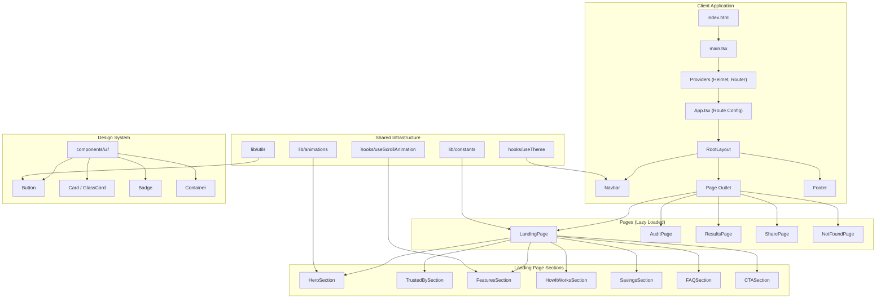

# NeuralCost — Architecture Document

## Stack Reasoning

| Choice | Rationale |
|--------|-----------|
| **Vite** | Fastest dev server and build tool. Native ES modules, sub-second HMR. Industry standard for React SPAs. |
| **React 19** | Latest stable with improved Suspense, transitions, and built-in head management. Largest ecosystem. |
| **TypeScript 6** | Strict type safety prevents runtime errors. Essential for production code. |
| **Tailwind CSS v4** | CSS-native configuration (no JS config file). Utility-first approach enables rapid, consistent styling. |
| **React Router v7** | Library mode for SPA routing. Lazy loading for code splitting. Stable, well-documented. |
| **Motion** | Production-quality animation library. Declarative API, gesture support, scroll-triggered animations. |
| **Lucide React** | Consistent, tree-shakeable icon set. Same design language as Linear/Vercel. |

## Architecture Overview



## Frontend Architecture

### Component Hierarchy

```
Providers
└── BrowserRouter + HelmetProvider
    └── App (Routes)
        └── RootLayout
            ├── Navbar (sticky, glass effect)
            ├── AnimatePresence
            │   └── Page Content (Outlet)
            └── Footer
```

### Data Flow (Phase 1)

Phase 1 is purely presentational. All data lives in `lib/constants.ts` as typed readonly objects. No state management library needed yet.

**Phase 2+ Data Flow (Planned):**
```
User Input → Local State (useState) → Audit Engine (pure functions) → Results
                                                                      ↓
                                                                  localStorage
                                                                      ↓
                                                              Shareable URL
```

### Code Splitting Strategy

All pages are lazy-loaded via `React.lazy()` + `Suspense`:
- Landing page bundle: ~22KB (gzipped ~6KB)
- Each other page: ~1-3KB
- Shared vendor bundle: ~196KB (React + Motion + Router)

### Component Design Principles

1. **Composition over inheritance** — Components accept `children` and compose via slots
2. **Variant pattern** — Button, Card, Badge use variant props instead of separate components
3. **Motion-first** — Animation presets are centralized in `lib/animations.ts`
4. **Barrel exports** — Each module has an `index.ts` for clean imports
5. **Typed props** — Every component has an explicit TypeScript interface

## Scalability Considerations

### Feature Module Pattern

```
features/
├── landing/          # Self-contained feature
│   ├── components/   # Feature-specific components
│   └── index.ts      # Public API (barrel export)
├── audit/            # Phase 2
│   ├── components/
│   ├── hooks/        # Feature-specific hooks
│   ├── utils/        # Feature-specific logic
│   └── index.ts
└── results/          # Phase 2
```

Each feature is a self-contained module with its own components, hooks, and utilities. Shared code lives in `components/ui/`, `hooks/`, and `lib/`.

### Performance Budget

| Metric | Target | Current |
|--------|--------|---------|
| First Contentful Paint | < 1.5s | ✅ |
| Total JS (gzipped) | < 150KB | ~68KB |
| CSS (gzipped) | < 15KB | ~8KB |
| Lighthouse Performance | > 90 | TBD |

### Future Scaling Path

- **State Management**: Zustand for global state (if needed)
- **API Layer**: TanStack Query for server state
- **Backend**: Serverless functions (Vercel/Cloudflare Workers)
- **Database**: Supabase or PlanetScale
- **Auth**: Clerk or Supabase Auth
- **Analytics**: PostHog or Mixpanel
